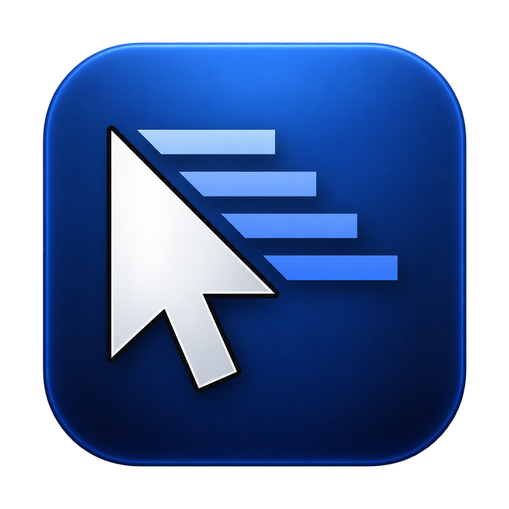

# Turbo Mouse

A macOS menu bar app for tuning your mouse, per device.

## Features

- **Acceleration** — adjust the curve, or turn it off completely for raw 1:1 tracking
- **Pointer speed** — ×0.1 to ×10, independent of acceleration
- **Scrolling** — adjust or disable scroll acceleration
- **Smooth scrolling** — trackpad-like glide for the scroll wheel (needs Accessibility permission)
- Keyboards with pointer controls are detected and left alone
- Settings persist per device and are restored when you quit

## Install

Download the latest release from [Releases](https://github.com/MariuzM/mac-turbo-mouse/releases), unzip, and move `Turbo Mouse.app` to `/Applications`. On first launch: right-click → Open.

Requires macOS 14+.

## Build from source

```sh
./scripts/make-app.sh
open "build/Turbo Mouse.app"
```

## Todo

- Move the scroll event tap and glide timer to a dedicated background thread (own run loop), so scroll latency can't be affected by UI stalls on the main thread.
